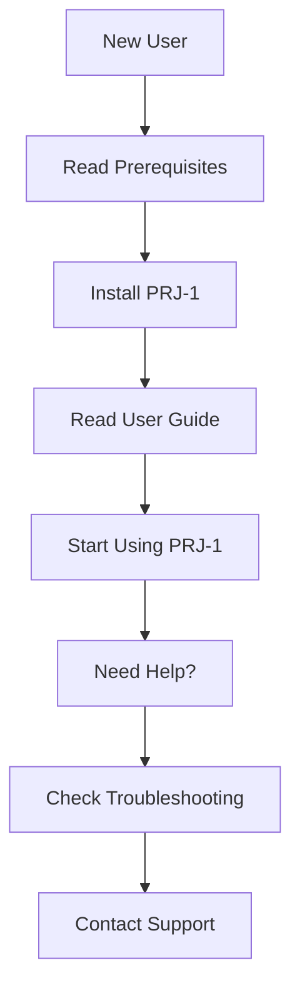
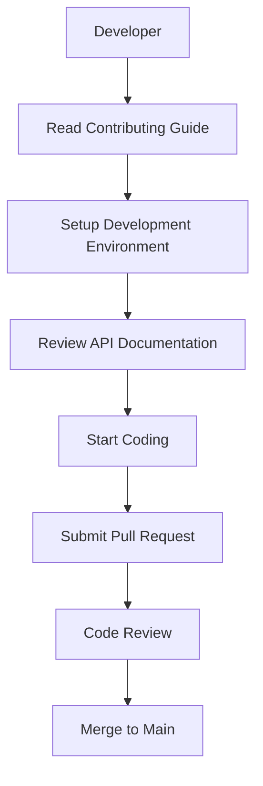
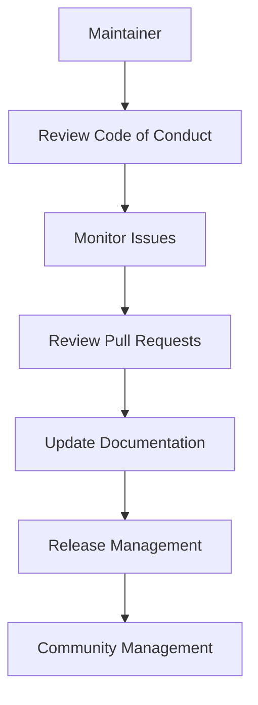

# PRJ-1 Documentation Index

Welcome to the PRJ-1 documentation hub. This index provides an overview of all available documentation resources to help you get started, contribute, and make the most of the project.

## 📚 Documentation Overview

### Getting Started
- **[User Guide](User_Guide.md)** - Complete user manual for end-users
  - Installation instructions
  - Feature overview
  - Usage tutorials
  - Troubleshooting guide

- **[Prerequisites](PREREQUISITES.md)** - System requirements and setup
  - System requirements
  - Software dependencies
  - Installation instructions
  - Verification steps

### Technical Documentation
- **[API Documentation](API.md)** - Technical API reference
  - Core classes and methods
  - UI components
  - Utility modules
  - Data structures
  - Event system

### Contributing
- **[Contributing Guide](CONTRIBUTING.md)** - How to contribute to the project
  - Development setup
  - Code standards
  - Pull request process
  - Testing guidelines
  - Documentation standards

- **[Code of Conduct](CODE_OF_CONDUCT.md)** - Community guidelines
  - Community pledge
  - Standards of behavior
  - Enforcement guidelines
  - Reporting procedures

### Project Management
- **[README.md](../README.md)** - Project overview and quick start
- **[CHANGELOG.md](../CHANGELOG.md)** - Version history and changes
- **[TO_DO.md](../TO_DO.md)** - Current tasks and roadmap
- **[LICENSE](../LICENSE)** - Project license

## 🚀 Quick Navigation

### For Users


### For Developers


### For Maintainers


## 📋 Documentation Structure

```
docs/
├── INDEX.md                 # This file - Documentation index
├── User_Guide.md           # User documentation
├── API.md                  # Technical API reference
├── CONTRIBUTING.md         # Contribution guidelines
├── CODE_OF_CONDUCT.md      # Community guidelines
├── PREREQUISITES.md        # System requirements
├── STRUCT.md               # Project structure
├── ROADMAP.md              # Development roadmap
├── SECURITY.md             # Security information
└── app_list.md             # Application list
```

## 🔍 Search Documentation

### Common Topics

#### Installation & Setup
- **System Requirements**: See [Prerequisites](PREREQUISITES.md#system-requirements)
- **Installation Steps**: See [Prerequisites](PREREQUISITES.md#installation-instructions)
- **Troubleshooting**: See [User Guide](User_Guide.md#troubleshooting)

#### Features & Usage
- **Main Features**: See [User Guide](User_Guide.md#main-features)
- **Project Browser**: See [User Guide](User_Guide.md#using-the-project-browser)
- **Main Dialog**: See [User Guide](User_Guide.md#main-dialog)
- **Language Support**: See [User Guide](User_Guide.md#language-support)

#### Development
- **Code Standards**: See [Contributing Guide](CONTRIBUTING.md#code-standards)
- **API Reference**: See [API Documentation](API.md)
- **Testing**: See [Contributing Guide](CONTRIBUTING.md#testing)
- **Pull Request Process**: See [Contributing Guide](CONTRIBUTING.md#pull-request-process)

#### Community
- **Code of Conduct**: See [Code of Conduct](CODE_OF_CONDUCT.md)
- **Contributing**: See [Contributing Guide](CONTRIBUTING.md)
- **Reporting Issues**: See [Contributing Guide](CONTRIBUTING.md#reporting-issues)

## 📖 Documentation by Role

### End Users
- **[User Guide](User_Guide.md)** - Everything you need to use PRJ-1
- **[Prerequisites](PREREQUISITES.md)** - Make sure your system is ready
- **[README.md](../README.md)** - Quick project overview

### Developers
- **[API Documentation](API.md)** - Technical reference for development
- **[Contributing Guide](CONTRIBUTING.md)** - How to contribute code
- **[Prerequisites](PREREQUISITES.md)** - Development environment setup

### Contributors
- **[Contributing Guide](CONTRIBUTING.md)** - Complete contribution workflow
- **[Code of Conduct](CODE_OF_CONDUCT.md)** - Community guidelines
- **[API Documentation](API.md)** - Understanding the codebase

### Maintainers
- **[Contributing Guide](CONTRIBUTING.md)** - Review guidelines
- **[Code of Conduct](CODE_OF_CONDUCT.md)** - Enforcement procedures
- **[ROADMAP.md](ROADMAP.md)** - Project planning
- **[CHANGELOG.md](../CHANGELOG.md)** - Release management

## 🔄 Keeping Documentation Updated

### When to Update Documentation
- **New Features**: Update User Guide and API documentation
- **API Changes**: Update API documentation
- **Bug Fixes**: Update relevant sections if user-facing
- **New Contributors**: Ensure Contributing Guide is current
- **New Releases**: Update CHANGELOG and version information

### Documentation Standards
- Use Markdown format
- Follow existing style and structure
- Include examples where helpful
- Keep content up-to-date with code changes
- Use clear, concise language
- Include table of contents for longer documents

## 📞 Getting Help

### Documentation Issues
- **Missing Information**: Create an issue requesting additional documentation
- **Outdated Content**: Submit a pull request to update documentation
- **Unclear Sections**: Suggest improvements or ask for clarification

### Technical Support
- **Bug Reports**: Use GitHub issues with detailed information
- **Feature Requests**: Submit ideas through GitHub issues
- **General Questions**: Join our Discord community
- **Code Help**: Refer to API documentation and contributing guide

### Community Support
- **Discord**: [Join our community server](https://discord.gg/ryqNeuRYjD)
- **GitHub**: [Report issues or request features](https://github.com/Nsfr750/PRJ-1)
- **Email**: Contact the maintainer at nsfr750@yandex.com

## 📊 Documentation Metrics

| Document | Purpose | Audience | Last Updated |
|----------|---------|----------|--------------|
| User_Guide.md | End-user documentation | Users | v0.1.5 |
| API.md | Technical reference | Developers | v0.1.5 |
| CONTRIBUTING.md | Contribution guidelines | Contributors | v0.1.5 |
| CODE_OF_CONDUCT.md | Community guidelines | All | v0.1.5 |
| PREREQUISITES.md | System requirements | Users/Developers | v0.1.5 |
| INDEX.md | Documentation index | All | v0.1.5 |

## 🎯 Quick Links

### Quick Start
- [🚀 Installation Guide](PREREQUISITES.md#installation-instructions)
- [📖 User Manual](User_Guide.md)
- [🔧 API Reference](API.md)

### Development
- [💻 Contributing Guide](CONTRIBUTING.md)
- [📝 Code Standards](CONTRIBUTING.md#code-standards)
- [🧪 Testing Guidelines](CONTRIBUTING.md#testing)

### Community
- [🤝 Code of Conduct](CODE_OF_CONDUCT.md)
- [💬 Discord Community](https://discord.gg/ryqNeuRYjD)
- [🐛 Report Issues](https://github.com/Nsfr750/PRJ-1/issues)

---

This documentation index is maintained as part of the PRJ-1 project. For the most up-to-date information, always refer to the latest version in the repository.

© Copyright 2025 Nsfr750 - All rights reserved
